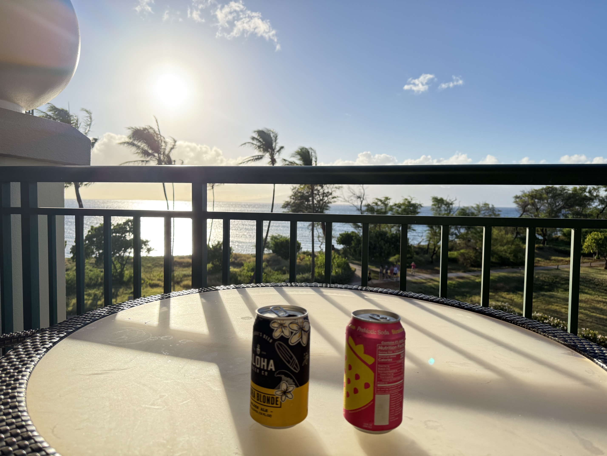

 
================================================================================================================================

I know used-less languages like Fortran, Pascal, & COBOL

*   🌍  I'm based in Alta California
*   🚀  I'm currently working on [a better Othello than the one created on my TRS80 decades ago](http://www.matthewan.com)
*   🧠  I'm currently learning always
*   👥  I'm looking to collaborate on finding great eats.
*   💬  I enjoy Viet & Korean Food, Hawaii, Florida and working to support the family.   

                  

                  

### Socials
                

 <a href="https://www.github.com/anmatthew" target="_blank" rel="noreferrer"> <picture> <source media="(prefers-color-scheme: dark)" srcset="https://raw.githubusercontent.com/danielcranney/readme-generator/main/public/icons/socials/github-dark.svg" /> <source media="(prefers-color-scheme: light)" srcset="https://raw.githubusercontent.com/danielcranney/readme-generator/main/public/icons/socials/github.svg" />  </picture> </a> <a href="https://www.x.com/matth3wan" target="_blank" rel="noreferrer"> <picture> <source media="(prefers-color-scheme: dark)" srcset="https://raw.githubusercontent.com/danielcranney/readme-generator/main/public/icons/socials/twitter-dark.svg" /> <source media="(prefers-color-scheme: light)" srcset="https://raw.githubusercontent.com/danielcranney/readme-generator/main/public/icons/socials/twitter.svg" />  </picture> </a>

